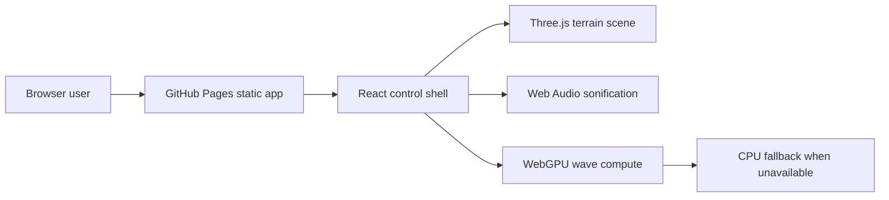

# Earthquake-Wave Propagation

Live site: https://baditaflorin.github.io/earthquake-wave-propagation/

Repository: https://github.com/baditaflorin/earthquake-wave-propagation

Interactive WebGPU demo: click a fault to see and hear P-waves and S-waves
propagate across terrain.

## Quickstart

```bash
npm install
make dev
make build
make test
make smoke
```

## Architecture



## Project Links

GitHub: https://github.com/baditaflorin/earthquake-wave-propagation

PayPal: https://www.paypal.com/paypalme/florinbadita
