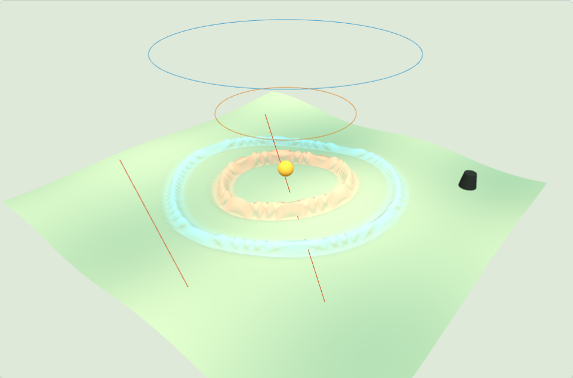
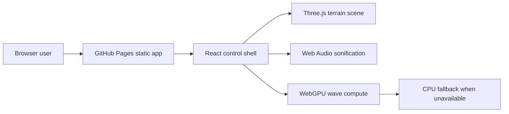

# Earthquake-Wave Propagation

Live site: https://baditaflorin.github.io/earthquake-wave-propagation/

Repository: https://github.com/baditaflorin/earthquake-wave-propagation

Interactive WebGPU demo: click a fault to see and hear P-waves and S-waves
propagate across terrain. The simulation is fully static on GitHub Pages and
falls back to CPU wave math when WebGPU is unavailable.



## Quickstart

```bash
npm install
make dev
make build
make test
make smoke
```

## What v0.1.0 Includes

- Fault-triggered P-wave and S-wave propagation on a Three.js terrain.
- WebGPU compute kernel with deterministic CPU fallback.
- Web Audio sonification gated by user interaction.
- GitHub repository and PayPal links on the live page.
- Visible version and commit metadata in the page footer.

## Architecture



## Project Links

GitHub: https://github.com/baditaflorin/earthquake-wave-propagation

PayPal: https://www.paypal.com/paypalme/florinbadita

ADRs: docs/adr/

Deploy guide: docs/deploy.md
