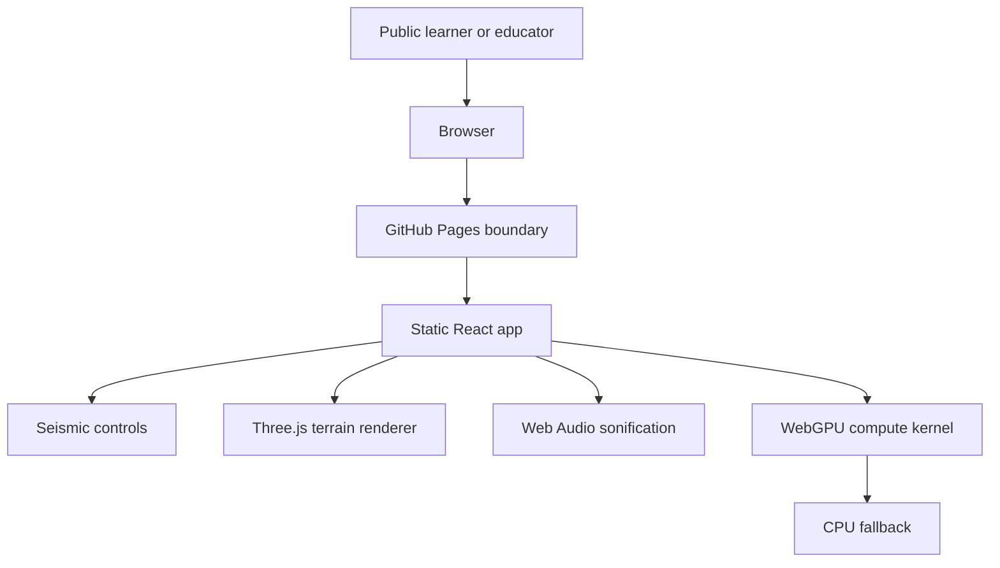

# Architecture

```mermaid
flowchart TB
  person["Public learner or educator"] --> browser["Browser"]
  browser --> pages["GitHub Pages boundary"]
  pages --> app["Static React app"]
  app --> controls["Seismic controls"]
  app --> scene["Three.js terrain renderer"]
  app --> audio["Web Audio sonification"]
  app --> compute["WebGPU compute kernel"]
  compute --> cpu["CPU fallback"]
```

GitHub Pages serves only static assets. All simulation, rendering, audio, and
preference storage happen in the browser.
